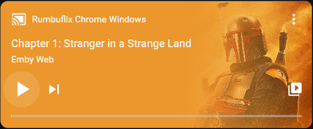
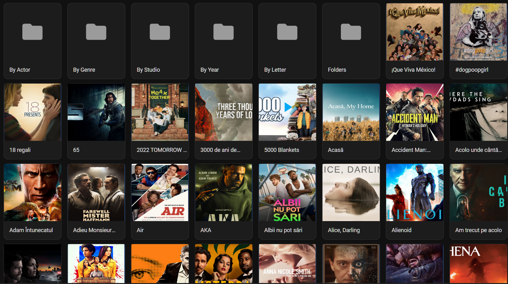
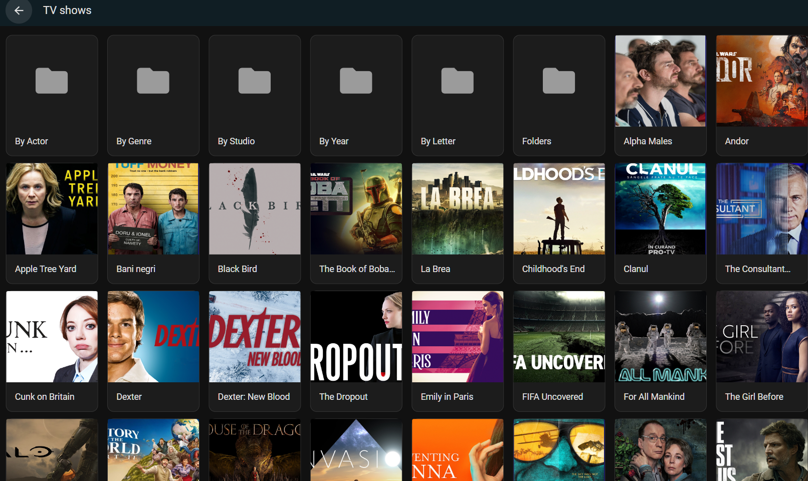

# Media Browser - Emby/Jellyfin integration



[![GitHub Release][releases-shield]][releases]

[![License][license-shield]](LICENSE)

[![hacs][hacsbadge]][hacs]


_Home Assistant integration for [Emby][emby] and [Jellyfin][jellyfin]._


## Summary

This integration support both media server types and can manage multiple servers. The following components are installed:
- [Media Source](#media-source) for browsing your server(s) libraries
- [Media Player](#media-players), one for each connected session
- [Session Sensor](#sessions-sensor) for active sessions
- [Library Sensor](#library-sensor), custom sensors for libraries, item types and users
- [Services][services] for sending commands or messages to active sessions
- [Server Button](#buttons) for rescanning, rebooting or stopping your server
- [Play Media Service][play_media] allowing you to play anything from your libraries based on various search criteria
- [Events][events] for pretty much every message sent by the server

## Installation

1. Using the tool of choice open the directory (folder) for your HA configuration (where you find `configuration.yaml`).
1. If you do not have a `custom_components` directory (folder) there, you need to create it.
1. In the `custom_components` directory (folder) create a new folder called `mediabrowser`.
1. Download _all_ the files from the `custom_components/mediabrowser/` directory (folder) in this repository or download the latest release
1. Place the files you downloaded in the new directory (folder) you created.
1. Restart Home Assistant
1. In the HA UI go to "Configuration" -> "Integrations" click "+" and search for `mediabrowser`

## Configuration

Configuration is done using user interface. The integration will try to detect automatically your server settings. In order to detect your Emby or Jellyfin servers, please configure your server firewall to allow UDP incoming packets on port 7359. If more than one server is found, a selection dialog will be displayed.

After selecting one of the available servers or if the integration discovers only one instance running in your network, the configuration dialog is displayed. Enter your Emby or Jellyfin *URL address* including the *port number* and the *HTTP protocol* to use.

|Setting|Required|Example|Comments|
|-|-|-|-|
|`URL`|yes|http://myflix:8096|Enter your Emby pr Jellyfin address. If you omit your port number, the integration will assume a *default port* (8096). Put *https* in formt of your url to *use SSL*|
|`User`|yes|Administrator|User name used to make various requests to the server. Please use an *administrative account* in order to let the integration access all libraries.|
|`Password`|yes|-|Password used to authenticate|
|`Name`|no|Myflix|Custom name of your server. This is used especialyy for entity naming. Leave blank to use the *default server name*|

Configuration is done at these step, a media player is created for each of the server sessions and three default library sensors are also created for your *Movies*, *Series* and *Songs*. 

## Options

If you are not happy with the default settings, you can fine tune the configuration by going in Home Assistant to *Settings*, *Device & Services*, select the *Media Browser* integration and click on the *Configure* button. A menu is diaplayed where you can choose your further action.

### Authentication options

Selecting authentication option will allow you to change the *Username* and *password*

|Setting|Required|Example|Comments|
|-|-|-|-|
|`User`|yes|Administrator|User name used to make various requests to the server. Please use an *administrative account* in order to let the integration access all libraries.|
|`Password`|yes|-|Password used to authenticate|

### Media Players options

Selecting Media Player option will alow you to control how the integration creates media players for server sessions. By default, all sessions will result in a different media player. If you are not interested in some sessions, you can avoid creating media player entities for them. Check the corresponding category and no more media players will be created.

|Setting|Comments|
|-|-|
|`Ignore web players`|The integration will not create media players for web sessions|
|`Ignore DLNA players`|The integration will not create media players for DLNA sessions|
|`Ignore mobile players`|The integration will not create media players for mobile sessions|
|`Ignore application players`|The integration will not create media players for known applications (e.g other integrations)|
|`Auto purge media players`|By default, media players which don't have a corresponding session on your server will stay in the entity registry as *unavailable*. This can happen when you manually delete on your server a device or when you choose to ignore some kind of players and they are not reported anymore to Home Assistant. In order to auto delete them, check the *purge* option, otherwise you can go to your *Entity Registry* in Home Assistant and delete them manually.|

### Library sensors options

|Setting|Comments|
|-|-|
|`Provide data for upcoming media card`|Library sensors provide already in the attributes information about the latest media added on your server, but also can provide the same information in a special format intended to be displayed in the well-known [Upcoming Media Card][upcoming-media-card].|

### Events options

|Setting|Resource Intensive|Comments|
|-|-|-|
|`Send events on session changes`|yes|Fire a Home Assistant event every time a session is added, removed or changed |
|`Send events for user activity`|yes|Fire a Home Assistant event every time a user has performed an action|
|`Send events for tasks`|yes|Fire a Home Assistant event every time a task is created, ended or is reporting progress|
|`Send other events`|no|Fire a Home Assistant other events.

Please note that some events are resource intensive and will flood the *Home Assistant Event Bus*. Enable them with care.

### Adding a library sensor

|Setting|Comments|
|-|-|
|`Item type`|Select the type of media you wang the monitor, e.g. Movies, Songs, Artists, Genres|
|`Library`|Select the library were the statistics will be calculated|
|`User`|Select the username which will be used as point of view when extractng statistics|

Please note that you cannot create two library sensors for the same combination of *type*, *library* and *user*.

### Removing a library sensor

Previously created sensors can be removed. Select the sensor to remove in the dialog.

### Advanced options:

|Setting|Comments|
|-|-|
|Server name|Custom name to be used when creating library sensors or media players|
|Client name|How this integration is reporting its name to your server|
|Device name|How this integration is reporting its device name to your server|
|Device identifier|How this integration is reporting its unique identifier to your server|
|Device version|How this integration is reporting its version to your server|
|Timeout|How much time to wait before considering that your connection to the server is down|

Generally speaking, it's better to not touch this settings, but if you need to clearly identify this integration in your Emby or Jellyfin server, this is the place to do it.

## Entities

### Buttons
The integration will create three buttons:
- one for restarting the server
- one for stopping the server
- one for rescanning libraries

### Media Players
Based on the [configuration options](#media-players-options), the integration will create multiple media players. Media players are created dinamically based on the online sessions reported by the server.

### Sessions sensor
The state of this sensor will report the *number of active sessions*. Supplementari, the attributes will display all sessions as a list with the following information:
- `user_name`
- `client`
- `device_name`
- `device_id`
- `application_version`
- `remote_end_point`
- `supports_remote_control`
- `app_icon_url`

### Library sensor
The state of this sensor will display the number of items in the library, based on the criteria you selected previously. Additionaly, the attributes will contain the following information about the newest 5 items:
- `id`
- `name`
- `community_rating`
- `critic_rating`
- `official_rating`
- `album`
- `season_name`
- `series_name`
- `overview`
- `production_year`
- `date_created`
- `premiere_date`
- `runtime`
- `episode`
- `studios`
- `genres`
- `artists`
- `tagline`
- various image links (`primary`, `backdrop`, `art`, etc)

## Media Source

Works with any player cappable to decode mp3 audio and h264 video.





## Services
### Service mediabrowser.send_message
Send a message to a session. 

|Service data attribute|Optional|Description|
|-|-|-|
|`target`|no|Any `device_id`, `entity_id` or `area_id` that is supported of the mediabrowser integration|
|`text`|no|The message content
|`header`|no|The message title
|`timeout`|yes|The message timeout. If omitted the user will have to confirm viewing the message|

Example:

```yaml
service: mediabrowser.send_message
target:
  entity_id: media_player.myflix_childroom
data:
  text: It is too late, please turn off your TV and go to sleep
  header: Parental Control
  timeout: 15
```

### Service mediabrowser.send_command
Send a command to a session. 

|Service data attribute|Optional|Description|
|-|-|-|
|`target`|no|Any `device_id`, `entity_id` or `area_id` that is supported of the mediabrowser integration|
|`command`|no|The command to be sent
|`arguments`|yes|Depending of the command, one or more arguments can be passed

Example:

```yaml
service: mediabrowser.send_command
target:
  entity_id: media_player.myflix_childroom
data:
  command: ChannelUp
```
For available commands and their arguments, please consult the relevant section on [Emby][emby-command] or [Jellyfin][jellyfin-command] API documentation

### Service mediaplayer.play_media
Plays the specified item

|Service data attribute|Optional|Description|
|-|-|-|
|`target`|no|Any `device_id`, `entity_id` or `area_id` that is supported of the mediabrowser integration|
|`media_content_id`|no|Media unique identifier as known by your server. You can obtain a media unique identifier by looking at any integration media player in *Developper Tools* and looking for `media_content_id `attribute while it is playing something. Another option is to use a json string (delimited by `{}`) to search for a specific item. Lookup in the [Emby][emby-media-id] or [Jellyfin][jellyfin-media-id] documentation for query parameters. The integration does automatically conversions to `CamelCase` or `snake_case`, you can use the one which suits you better|
|`media_content_type`|yes|Ignored

Example (unique identifier):

```yaml
service: mediaplayer.play_media
target:
  entity_id: media_player.myflix_childroom
data:
  media_content_id: 791245422247247
  media_content_type: movie
```
Example (search):

```yaml
service: mediaplayer.play_media
target:
  entity_id: media_player.myflix_childroom
data:
  media_content_id: {"name_starts_with" : "Avatar", "include_item_types" : "Movie"}
  media_content_type: movie
```

## Events

Various events can be fired by the integration, all of them starting with `mediabrowser_` Depending on the event, several information is passed along with it. Unfortunatelly the only way to know what data is avaialble is to look into schemas published by Emby or Jellyfin or in their source code. Of course, you can experient yourself in the *Developper Tools* by subscribing to such events:

- `mediabrowser_session_changed` (resource intensive, disabled by default)
- `mediabrowser_user_data_changed`
- `mediabrowser_restart_required`
- `mediabrowser_server-shutting_down`
- `mediabrowser_server-restarting`
- `mediabrowser_library_changed`
- `mediabrowser_user_deleted`
- `mediabrowser_user_updated`
- `mediabrowser_series_timer_created`
- `mediabrowser_timer_cancelled`
- `mediabrowser_refresh_progress`
- `mediabrowser_scheduled_task_ended` (resource intensive, disabled by default)
- `mediabrowser_scheduled_task_info` (resource intensive, disabled by default)
- `mediabrowser_package_installation_cancelled`
- `mediabrowser_package_installation_failed`
- `mediabrowser_package_installation_completed`
- `mediabrowser_package_unisntalled`
- `mediabrowser_activity_log_entry` (resource intensive, disabled by default)


## Contributions are welcome!

If you want to contribute to this please read the [Contribution guidelines](CONTRIBUTING.md)

***

[emby]: https://emby.media
[jellyfin]: https://jellyfin.org
[buymecoffee]: https://www.buymeacoffee.com/rumbu13
[buymecoffeebadge]: https://img.shields.io/badge/buy%20me%20a%20coffee-donate-yellow.svg?style=for-the-badge
[commits-shield]: https://img.shields.io/github/commit-activity/y/rumbu13/ha-mediabrowser.svg?style=for-the-badge
[commits]: https://github.com/rumbu13/ha-mediabrowser/commits/main
[hacs]: https://github.com/hacs/integration
[hacsbadge]: https://img.shields.io/badge/HACS-Custom-orange.svg?style=for-the-badge
[forum-shield]: https://img.shields.io/badge/community-forum-brightgreen.svg?style=for-the-badge
[forum]: https://community.home-assistant.io/
[license-shield]: https://img.shields.io/github/license/rumbu13/ha-mediabrowser.svg?style=for-the-badge
[maintenance-shield]: https://img.shields.io/badge/maintainer-rumbu13-blue.svg?style=for-the-badge
[releases-shield]: https://img.shields.io/github/release/rumbu13/ha-mediabrowser.svg?style=for-the-badge
[releases]: https://github.com/rumbu13/ha-mediabrowser/releases

[services]: #services
[events]: #events
[mediasource]: https://www.home-assistant.io/integrations/#media-source
[mediaplayer]: https://www.home-assistant.io/integrations/#media-player
[sensor]: https://www.home-assistant.io/integrations/#sensor
[button]: https://www.home-assistant.io/integrations/#button
[play_media]: #service-mediaplayerplay_media

[emby-command]: http://swagger.emby.media/?staticview=true#/SessionsService/postSessionsByIdCommand
[jellyfin-command]: https://api.jellyfin.org/#tag/Session/operation/SendGeneralCommand
[upcoming-media-card]: https://github.com/custom-cards/upcoming-media-card

[emby-media-id]: http://swagger.emby.media/?staticview=true#/ItemsService/getItems
[jellyfin-media-id]: https://api.jellyfin.org/#tag/Items/operation/GetItems
