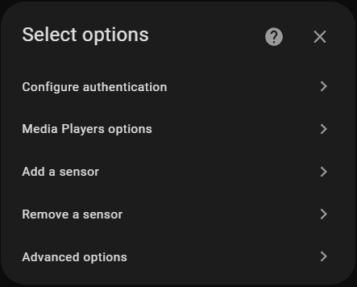
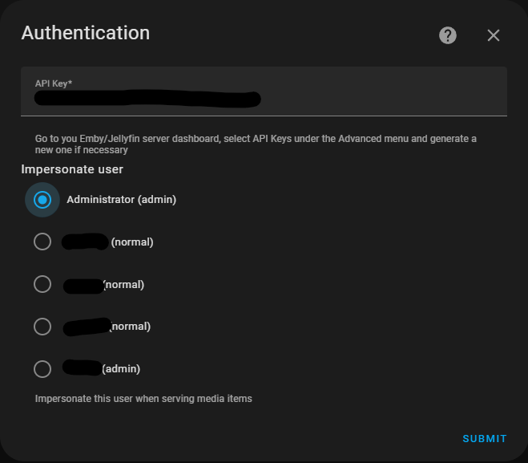
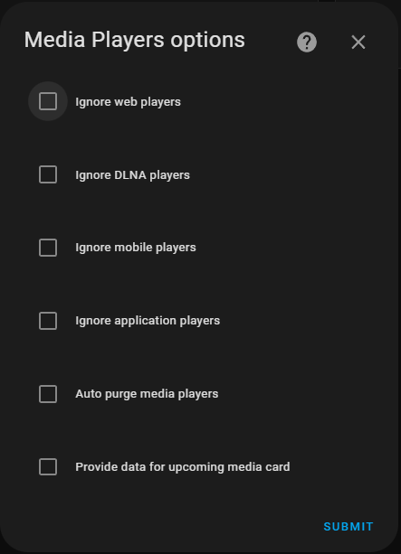
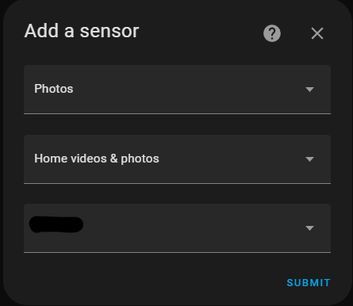
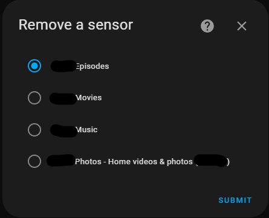

# Media Browser - Emby/Jellyfin integration

[![GitHub Release][releases-shield]][releases]
[![GitHub Activity][commits-shield]][commits]
[![License][license-shield]](LICENSE)

[![hacs][hacsbadge]][hacs]
![Project Maintenance][maintenance-shield]
[![BuyMeCoffee][buymecoffeebadge]][buymecoffee]

[![Community Forum][forum-shield]][forum]

_Home Assistant integration for [Emby][emby] and [Jellyfin][jellyfin]._


## Summary

This integration support both media server types. The following components are installed:
- [Media Source][mediasource] for browsing your server(s) libraries
- [Media Player][mediaplayer], one for each connected session
- [Session Sensor][sensor] for active sessions
- [Library Sensor][sensor], custom sensors for libraries, item types and users
- [Services][services] for sending commands or messages to active sessions
- [Server Button][button] for rescanning, rebooting or stopping your server
- [Play Media Service][play_media] allowing you to play anything from your libraries based on various search criteria
- [Events][events] for pretty much every message sent by the server


## Installation

1. Using the tool of choice open the directory (folder) for your HA configuration (where you find `configuration.yaml`).
1. If you do not have a `custom_components` directory (folder) there, you need to create it.
1. In the `custom_components` directory (folder) create a new folder called `mediabrowser`.
1. Download _all_ the files from the `custom_components/mediabrowser/` directory (folder) in this repository or download the latest release
1. Place the files you downloaded in the new directory (folder) you created.
1. Restart Home Assistant
1. In the HA UI go to "Configuration" -> "Integrations" click "+" and search for `mediabrowser`

## Configuration

Configuration is done using user interface. The integration will try to detect automatically your server settings. In order to detect your Emby or Jellyfin servers, please configure your server firewall to allow UDP incoming packets on port 7359. If more than one server is found, a selection dialog will be displayed.

After selecting one of the available servers or if the integration discovers only one instance running in your network, the configuration dialog is displayed. Enter your Emby or Jellyfin *URL address* including the *port number* and the *HTTP protocol* to use.

|Setting|Required|Example|Comments|
|-|-|-|-|
|`URL`|yes|http://myflix:8096|Enter your Emby pr Jellyfin address. If you omit your port number, the integration will assume a *default port* (8096). Put *https* in formt of your url to *use SSL*|
|`User`|yes|Administrator|User name used to make various requests to the server. Please use an *administrative account* in order to let the integration access all libraries.
|`Password`|yes|-|Password used to authenticate
|`Name`|no|Myflix|Custom name of your server. This is used especialyy for entity naming. Leave blank to use the *default server name*


Configuration is done at these step, a media player is created for each of the server sessions and three default library sensors are also craeted for your *Movies*, *Series* and *Songs*.

## Options

If you are not happy with the default settings, you can fine tune the configuration by going in Hoe Assistant to *Settings*, *Device & Services*, select the *Media Browser* integration and click on the *Configure* button. A menu is diaplayed where you can choose your further action.



Selecting authentication option will allow you to change the *API key* or the *user* used in various interactions with your server. By default, the integration will select automatically the first user with administrative privileges and with access to all your libraries. Though not recommended, you can select another user, but please note that the integration needs administrative access to your server for most interactions.



Selecting Media Player option will alow you to control how the integration creates media players for server sessions. By default, all sessions will result in a different media player. If you are not interested in some sessions, you can avoid creating media player entities for them. Check the corresponding category and no more media players will be created.

By default, media players which don't have a corresponding session on your server will stay in the entity registry as *unavailable*. This can happen when you manually delete on your server a device or when you choose to ignore some kind of players and they are not reported anymore to Home Assistant. In order to auto delete them, check the *purge* option, otherwise you can go to your *Entity Registry* in Home Assistant and delete them.

Library sensors provide already in the attributes information about the latest media added on your server, but also can provide the same information in a special format intended to be displayed in the well-known [Upcoming Media Card][upcoming-media-card].



You can add a new library sensor by selecting the relevant properties. You must choose the *type of media* that will be bound to the sensor and optionally the *library* and the *user*. The information extracted from your server will be limited to the sepcified library and/or user



Previously created sensors can be removed




## Services
### Service mediabrowser.send_message
Send a message to a session. 

|Service data attribute|Optional|Description|
|-|-|-|
|`target`|no|Any `device_id`, `entity_id` or `area_id` that is supported of the mediabrowser integration|
|`text`|no|The message content
|`header`|no|The message title
|`timeout`|yes|The message timeout. If omitted the user will have to confirm viewing the message|

Example:

```yaml
service: mediabrowser.send_message
target:
  entity_id: media_player.myflix_childroom
data:
  text: It is too late, please turn off your TV and go to sleep
  header: Parental Control
  timeout: 15
```

### Service mediabrowser.send_command
Send a command to a session. 

|Service data attribute|Optional|Description|
|-|-|-|
|`target`|no|Any `device_id`, `entity_id` or `area_id` that is supported of the mediabrowser integration|
|`command`|no|The command to be sent
|`arguments`|yes|Depending of the command, one or more arguments can be passed

Example:

```yaml
service: mediabrowser.send_command
target:
  entity_id: media_player.myflix_childroom
data:
  command: ChannelUp
```
For available commands and their arguments, please consult the relevant section on [Emby][emby-command] or [Jellyfin][jellyfin-command] API documentation

## Contributions are welcome!

If you want to contribute to this please read the [Contribution guidelines](CONTRIBUTING.md)

***

[emby]: https://emby.media
[jellyfin]: https://jellyfin.org
[buymecoffee]: https://www.buymeacoffee.com/rumbu13
[buymecoffeebadge]: https://img.shields.io/badge/buy%20me%20a%20coffee-donate-yellow.svg?style=for-the-badge
[commits-shield]: https://img.shields.io/github/commit-activity/y/rumbu13/ha-mediabrowser.svg?style=for-the-badge
[commits]: https://github.com/rumbu13/ha-mediabrowser/commits/main
[hacs]: https://github.com/hacs/integration
[hacsbadge]: https://img.shields.io/badge/HACS-Custom-orange.svg?style=for-the-badge
[forum-shield]: https://img.shields.io/badge/community-forum-brightgreen.svg?style=for-the-badge
[forum]: https://community.home-assistant.io/
[license-shield]: https://img.shields.io/github/license/rumbu13/ha-mediabrowser.svg?style=for-the-badge
[maintenance-shield]: https://img.shields.io/badge/maintainer-rumbu13-blue.svg?style=for-the-badge
[releases-shield]: https://img.shields.io/github/release/rumbu13/ha-mediabrowser.svg?style=for-the-badge
[releases]: https://github.com/rumbu13/ha-mediabrowser/releases

[services]: #services
[mediasource]: https://www.home-assistant.io/integrations/#media-source
[mediaplayer]: https://www.home-assistant.io/integrations/#media-player
[sensor]: https://www.home-assistant.io/integrations/#sensor
[button]: https://www.home-assistant.io/integrations/#button
[play_media]: https://www.home-assistant.io/integrations/media_player/#service-media_playerplay_media

[emby-command]: http://swagger.emby.media/?staticview=true#/SessionsService/postSessionsByIdCommand
[jellyfin-command]: https://api.jellyfin.org/#tag/Session/operation/SendGeneralCommand
[upcoming-media-card]: https://github.com/custom-cards/upcoming-media-card
